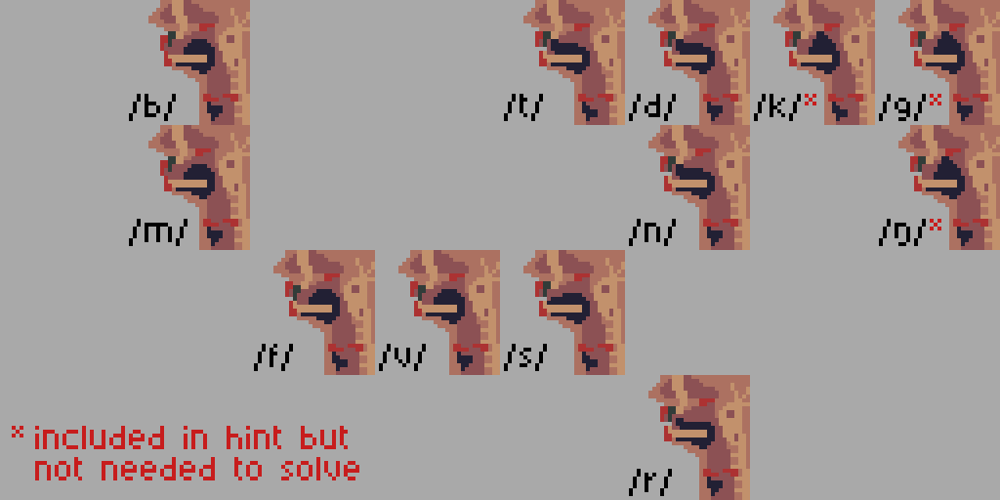
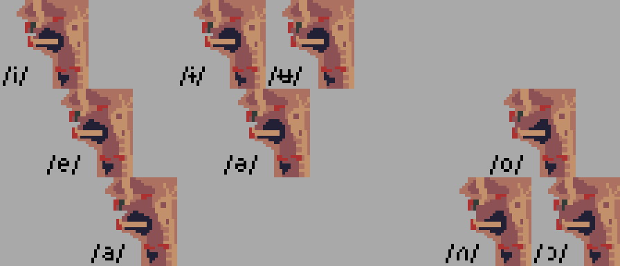

# Solution

These are midsagittal diagrams drawn with a little bit of artistic freedom. 

- The lips, velum and glottis are highlighted in red 
- The teeth are highlighted in green 
- The tongue and voice box are highlighted in blue

## Consonants
- Stops are one frame, all other phones are two
- Voiced two-frame consonants have a "vibrating" voice box
- Voiced one-frame consonants have a "raised" voice box and unvoiced stops have a "relaxed" voice box

## Vowels
- Standard Australian vowels
- The hint showed that the head speaks with a non-rhotic accent
  

  
## Password glossing

1. /in.vest.mə.nt/ - investment
2. /tɔ:n/ - torn
3. /ɹa.bət/ - rabbit
4. /də.fend/ - defend
