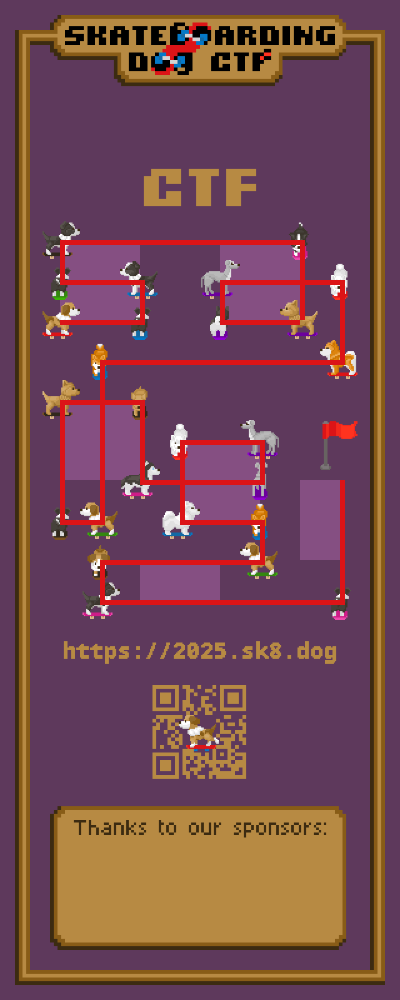

# Solution
   


1. Trace the dogs' path to the flag
3. This reveals the cluephrase for the second part of the puzzle, `same=1`
4. Each edge of the path gives a 1 or 0 based on whether the dog breed changes, and another bit for the skateboard
   ```
   Dog: 0111100000100010010100101
   Skateboard: 0100001101000110010010001
   ```
5. Convert to letters using A0Z25
   ```py
   b = '01111000001000100101001010100001101000110010010001'
   
   print(''.join([chr(ord('a')+int(b[i:i+5],2)) for i in range(0,len(b),5)]))
   ```
6. This gives flag "parffinder"
